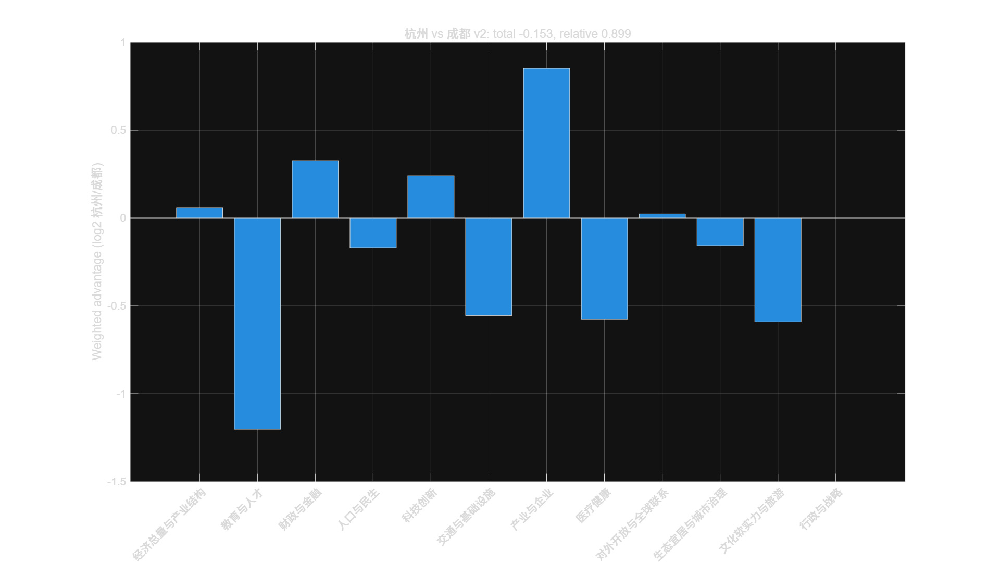

# 城市综合实力比较模型 v2

[](LICENSE)
[](https://www.mathworks.com/products/matlab.html)
[](../../releases)
[](../../stargazers)

> 用一份公开数据，把两座城市放在同一把尺子上量一量。

输入两座城市的数据表，输出一份可复现的**综合实力对比报告**：硬实力/软实力加权得分、
12 个大类的强弱分布、逐项胜负统计和分类对比图。

---

## 这个模型能做什么

- **270 项指标**：经济、产业、财政金融、人口民生、医疗、交通、教育、科技、文化、生态、行政共 12 大类。
- **软 3 硬 7**：硬实力占 70%、软实力占 30%，符合"先看家底、再看气质"的常识判断。
- **冗余折扣**：对 GDP、工业、财政等高度相关的指标做权重折扣，避免"经济规模"被重复计算六七次。
- **对数差距计分**：正向指标用 `log2(A/B)`，反向指标反向计算，单指标截断在 ±3，避免单项冠军带偏全局。
- **只吃公开数据**：全部取自统计公报、统计年鉴和权威榜单，数据来源逐条可查。

## 效果展示



（图为"杭州 vs 成都"12 个大类的加权优势分布）

## 快速开始

**1. 准备两张表**：权重表和双城数据表。

```text
权重表：原表指标, 规范指标, 类别, 实力类型, 指标方向, 基准权重, 冗余折扣系数, 最终有效权重, 特殊计分规则
数据表：原表指标, 规范指标, 城市A值, 城市B值, 数据年份, 数据来源, 单位, 是否更新
```

**2. 放进同一个文件夹**，复制 `city_pair_model_v2.m`。

**3. 在 MATLAB 里执行**：

```matlab
city_pair_model_v2('通用权重v2.csv', '数据表.csv', '杭州', '成都', '杭州成都')
```

**4. 得到四个产物**：

```text
杭州成都综合实力总览v2.csv    # 硬/软/综合优势 + 相对强度指数
杭州成都综合实力结果v2.csv    # 12 个大类的加权优势与胜负项
杭州成都综合实力摘要v2.txt    # 一段话结论
杭州成都综合实力分类图v2.png  # 分类对比图
```

> 不会 MATLAB？看 [MATLAB小白喂数据流程.md](MATLAB小白喂数据流程.md)，从零开始一步步截图级教程。

## 实测结果（部分）

| 城市组合 | 硬实力 | 软实力 | 综合 | 前城综合指数 |
|---|---|---|---|---|
| 北京 对 上海 | -0.01379 | +0.44628 | +0.12423 | 108.99 |
| 北京 对 天津 | +0.80226 | +1.53685 | +1.02264 | 203.16 |
| 上海 对 深圳 | +0.34664 | +0.61679 | +0.42768 | 134.51 |
| 天津 对 沈阳 | +0.62655 | +0.92270 | +0.71540 | 164.19 |
| 沈阳 对 大连 | +0.09883 | -0.17045 | +0.01805 | 101.26 |
| 沈阳 对 哈尔滨 | +0.34265 | +0.36493 | +0.34933 | 127.40 |
| 沈阳 对 西安 | -0.40978 | -1.17759 | -0.64012 | 64.17 |
| 西安 对 天津 | -0.21043 | +0.02592 | -0.13952 | 90.78 |
| 杭州 对 苏州 | +0.01923 | -0.22684 | -0.05460 | 96.29 |
| 杭州 对 南京 | +0.18932 | -0.33914 | +0.03078 | 102.16 |
| 杭州 对 成都 | -0.06833 | -0.51391 | -0.20201 | 86.93 |
| 成都 对 广州 | -0.09650 | -0.18038 | -0.12166 | 91.91 |
| 北京 对 辽宁（省级） | +0.37337 | +1.61671 | +0.74637 | 167.76 |

> 指数含义：后城 = 100 时，前城的相对综合强度。96.29 表示前城约为后城的 96%。

## 数据来源

- 各市**统计公报**（主）：GDP、产业、财政、金融、人口、收入、医疗、交通等
- 各市**统计年鉴**（补充）：税收明细、用电量、工资等公报未披露项
- **软科中国大学排名**：高校实力
- **复旦医院排行榜**：医院实力
- 各部委名单：5A 景区、双一流、重点实验室等

所有数据均标注年份与来源，缺失项留空、不写 0、不参与计算。

## 已知局限（重要）

这个模型是**方向性比较工具**，不是权威排名。请务必注意：

1. **总量指标对大城市有利**。同样一套数据，只用人均类指标时结论可能反转（例如杭州对成都：总量口径 0.87，人均口径 1.37）。
2. **大类内部样本量不均是最大风险**。数据可得性决定了某些大类只能由 1–3 个指标代表。
3. **口径差异**：博物馆、汽车保有量、农村居民收入等指标在不同城市统计范围不同。
4. **权重是主观的**。"软 3 硬 7"和具体指标权重来自建模者判断，不是客观真理。

因此建议**同时看总量口径与人均口径两套结果**，并把结论当作"讨论的起点"而不是"判决书"。

## Roadmap

- [ ] 在线版：无需 MATLAB，网页直接选两座城市出结果
- [ ] 自动更新：用 GitHub Actions 定期抓取公报并刷新对比总览
- [ ] 更多城市：目标覆盖全国主要城市，欢迎提 Issue 点单
- [ ] 英文文档与国际化
- [ ] 敏感性分析报告：输出基准值 + 区间

## 参与贡献

- 想比较**任意两座城市**？开一个 [Issue](../../issues) 告诉我们城市名，说明数据来源更好。
- 发现数据错误或口径问题？欢迎提 PR 修正，**注明来源**即可。
- 觉得有用的话，点个 ⭐ Star 是这个项目最大的动力。

## 引用

如果这个模型或论文对你有帮助，欢迎引用（见 [CITATION.cff](CITATION.cff)）：

```bibtex
@software{chengshi_duibi_v2,
  title   = {城市综合实力比较模型 v2},
  author  = {hwkiller-0314},
  year    = {2026},
  url     = {https://github.com/hwkiller-0314/city-comparision-model}
}
```

## License

代码采用 [MIT License](LICENSE)。论文与文档采用 CC BY 4.0。
